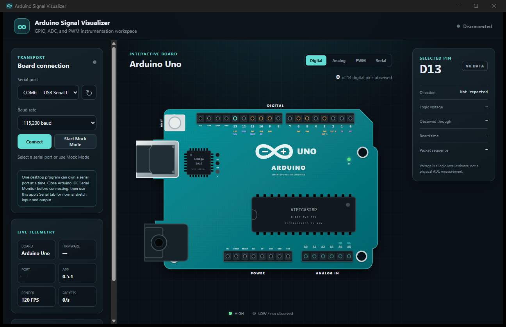
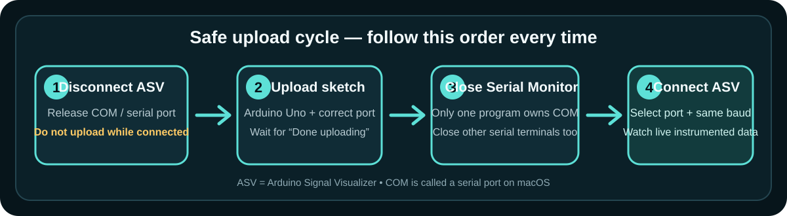
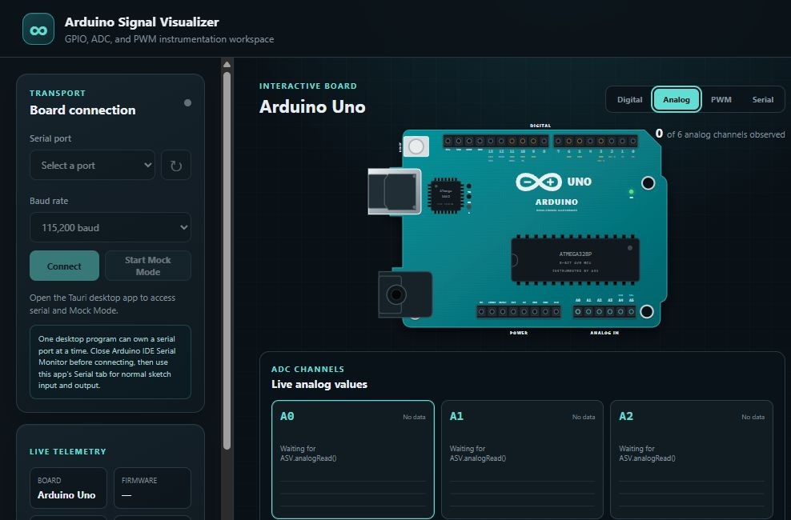
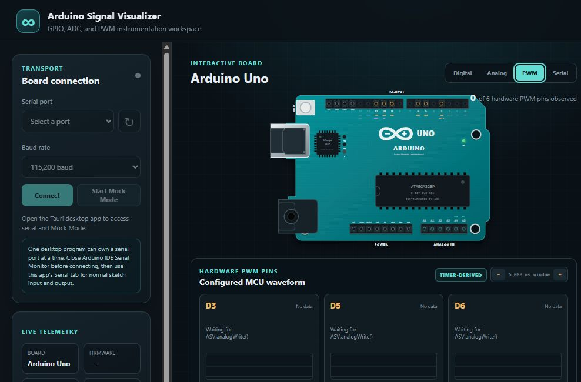
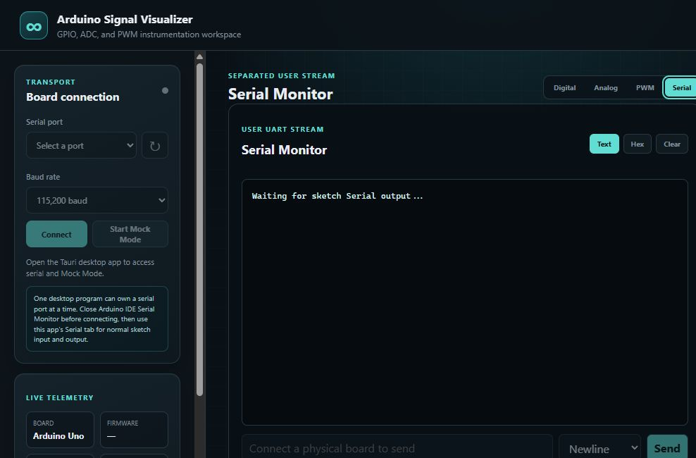

# Arduino Signal Visualizer

Arduino Signal Visualizer (ASV) turns operations from a real Arduino Uno into
live, understandable visuals for students, teachers, and self-learners.

[Download the current beta](https://github.com/TuzaaBap/arduino-signal-visualizer/releases/tag/v0.5.1-beta.1) ·
[Read the validation report](docs/beta-usability-validation.md) ·
[Report a problem](https://github.com/TuzaaBap/arduino-signal-visualizer/issues)



The application currently visualizes:

- digital GPIO state and pin direction;
- Uno ADC readings for A0-A5;
- configured hardware PWM on D3, D5, D6, D9, D10, and D11;
- the sketch's normal `Serial.print()` output in a separate Serial Monitor;
- TX, RX, and the Uno's built-in D13/L LED activity;
- connection state, packet rate, and protocol diagnostics.

ASV is not a simulator. It displays operations instrumented inside the real
sketch running on the Uno.

> [!IMPORTANT]
> **Disconnect ASV before every Arduino upload.** Arduino IDE, its Serial
> Monitor, another terminal, and ASV cannot own the same serial port at the
> same time. Upload first, close Arduino Serial Monitor, and then reconnect ASV.

## Why this project exists

A beginner can write an ordinary sketch and see what the MCU was configured to
do without first buying or learning a logic analyzer. The library performs the
instrumentation; the desktop app validates and presents it.

```text
Normal Arduino call
        ↓
ASV Arduino library records the operation
        ↓
CRC-protected telemetry + normal Serial share USB UART
        ↓
Rust validates and separates both streams
        ↓
Desktop displays Digital, Analog, PWM, and Serial views
```

The student still writes familiar Arduino code. ASV does not require lifecycle
calls in `setup()` or `loop()`.

## What you need

- Arduino Uno R3 or compatible ATmega328P Uno board.
- USB **data** cable. A charge-only cable cannot upload or stream data.
- Arduino IDE 2.
- Windows 10/11 x64, Apple-silicon macOS, or Intel macOS.
- The matching ASV desktop installer and Arduino library ZIP from the same
  release.

The v0.5.1 beta is specifically validated for the Arduino Uno. ESP32 and other
boards are not supported by this build.

## Install the beta

### 1. Download the desktop app and library

Open the [v0.5.1 beta release](https://github.com/TuzaaBap/arduino-signal-visualizer/releases/tag/v0.5.1-beta.1)
and download two files:

| Computer                     | Desktop file                                            |
| ---------------------------- | ------------------------------------------------------- |
| Windows 10/11 x64            | `Arduino-Signal-Visualizer-0.5.1-windows-x64-setup.exe` |
| Managed Windows installation | `Arduino-Signal-Visualizer-0.5.1-windows-x64.msi`       |
| Apple-silicon Mac            | `Arduino-Signal-Visualizer-0.5.1-darwin-aarch64.dmg`    |
| Intel Mac                    | `Arduino-Signal-Visualizer-0.5.1-darwin-x64.dmg`        |

Everyone also needs:

`ArduinoSignalVisualizer-0.5.1.zip`

Do not download source-code ZIPs instead of the Arduino library ZIP.

The public `v0.5.1-beta.1` artifacts are the current installable preview. The
`main` branch includes additional UART reliability work completed after that
artifact build; publish the next tagged beta before a managed classroom-wide
rollout.

### 2. Install the desktop app

On Windows, use the setup executable unless a school administrator specifically
requires the MSI. On macOS, open the DMG matching the Mac processor and move the
application into Applications.

The beta is not commercially code-signed or Apple-notarized yet. Windows
SmartScreen or macOS Gatekeeper may request confirmation. Only approve the app
when it was downloaded from this repository's release page. Do not disable
Windows Application Control, antivirus, SmartScreen, or Gatekeeper globally.

### 3. Install the Arduino library ZIP

In Arduino IDE 2:

1. Select **Sketch → Include Library → Add .ZIP Library…**
2. Choose `ArduinoSignalVisualizer-0.5.1.zip`.
3. Wait for the installation confirmation.
4. Confirm that **File → Examples → ArduinoSignalVisualizer** contains the ASV
   examples.

Do not unzip the library before using **Add .ZIP Library**. If Arduino IDE says
the library already exists, remove the older `ArduinoSignalVisualizer` library
or install the matching newer release before testing.

## Run your first sketch

### 1. Write normal Arduino code

Place `ASVInstrumented.h` after other library headers. This example is a normal
beginner Blink sketch:

```cpp
#include <ASVInstrumented.h>

void setup() {
  pinMode(13, OUTPUT);
}

void loop() {
  digitalWrite(13, HIGH);
  delay(1000);
  digitalWrite(13, LOW);
  delay(1000);
}
```

That single include is enough. Do not add `ASV.begin()`, `ASV.attach()`, or
`ASV.service()`.

If the sketch does not call `Serial.begin()`, ASV uses 115200 baud. If the
sketch calls `Serial.begin(9600)` or another supported rate, select that same
rate in the desktop app.

### 2. Upload safely



Follow this order every time the sketch changes:

1. In ASV, click **Disconnect**. Closing ASV also releases the port.
2. Close Arduino IDE Serial Monitor and any other serial terminal.
3. In Arduino IDE, select **Tools → Board → Arduino AVR Boards → Arduino Uno**.
4. Select the Uno's port under **Tools → Port**.
5. Click **Upload** and wait for **Done uploading**.
6. Keep Arduino Serial Monitor closed.
7. Open ASV, select the same port and baud rate, then click **Connect**.

Uploading while ASV is connected can produce an `access denied`, `port busy`,
or `avrdude` timeout. Disconnecting ASV is required; unplugging the board is
normally unnecessary.

### 3. Confirm the connection

After **Connect**:

- the top-right state changes to **Connected**;
- Firmware shows the matching firmware version;
- Port shows the selected COM or macOS serial device;
- Packets rise above `0/s` when the sketch produces instrumented activity;
- Diagnostics should remain at zero.

If the app stays at **Waiting for ASV firmware**, verify that the sketch includes
`ASVInstrumented.h` and that app and sketch use the same baud rate.

## Understand each screen

### Digital

The Digital tab is the default board view shown at the top of this README.
Select D0-D13 on the Uno drawing to inspect direction, HIGH/LOW state, event
source, board timestamp, and packet sequence.

Pin labels show the Uno's real alternate functions:

- PWM: D3, D5, D6, D9, D10, and D11;
- UART: D0 RX and D1 TX;
- external interrupts: D2 and D3;
- SPI: D10 SS, D11 MOSI, D12 MISO, and D13 SCK;
- I2C: A4 SDA and A5 SCL, duplicated at the SDA/SCL header.

The TX and RX indicators represent USB serial activity. The L indicator follows
the built-in LED controlled by D13. A digital voltage shown as 0 V or 5 V is a
logic-level estimate, not a physical voltage measurement.

### Analog



The Analog tab displays, for A0-A5:

- raw 10-bit ADC count;
- voltage calculated from the declared reference metadata;
- reference mode and reference millivolts;
- percentage of full scale;
- a bounded recent-sample graph.

Call normal `analogRead(A0)` to produce data. The voltage is an estimate, not a
calibrated multimeter reading. With the Uno's normal 5 V reference, never apply
a voltage outside the board's permitted input range.

### PWM



The PWM tab responds to normal `analogWrite()` calls on the six hardware PWM
pins. It displays rectangular pulses reconstructed from the ATmega328P timer
configuration, including frequency, period, HIGH time, LOW time, duty, timer
channel, prescaler, TOP, compare value, and counter value.

This is labelled **Configured MCU waveform** because it is derived from timer
registers. It is not a sampled electrical trace. A logic analyzer should show
the same configured timing within board-clock and measurement tolerances, but
noise, rise time, loading, and real pin voltage still require measurement
hardware.

### Serial



The Serial tab replaces Arduino IDE Serial Monitor while ASV owns the port.
Normal sketch text remains normal:

```cpp
Serial.begin(115200);
Serial.println("Hello from my sketch");
```

ASV telemetry is framed and CRC-protected. Rust removes those frames from the
user stream, so the Serial tab shows the student's text rather than protocol
bytes. Text, Hex display, line-ending selection, send, clear, received-byte,
buffered-byte, and dropped-byte indicators are available.

## How shared Serial behaves

The Uno has one USB UART with finite bandwidth. At 115200 baud, the physical
maximum is approximately 11,520 bytes per second using 8N1 framing.

ASV uses fixed, bounded latest-state slots for GPIO, ADC, and PWM and services
them fairly. Sequence numbers advance only after a complete frame enters the
UART. This prevents memory growth, partial ASV frames, and false packet-gap
warnings when the UART is busy.

When a sketch generates states faster than the UART can transport them, ASV
preserves the newest pending state for each signal. It does not claim to record
every electrical transition beyond the link capacity. Continuously filling the
UART with user `Serial` output can still starve instrumentation because software
cannot create bandwidth the Uno does not have.

Pins D0 and D1 are the same UART used by USB serial. Avoid using them as normal
GPIO while connected to ASV.

## Supported sketch calls

The transparent header instruments ordinary sketch calls to:

- `pinMode()`;
- `digitalWrite()`;
- `digitalRead()`;
- `analogReference()`;
- `analogRead()`;
- `analogWrite()`.

The Arduino core result is returned unchanged. Normal `Serial.begin()`,
`Serial.print()`, `Serial.available()`, `Serial.read()`, and `Serial.write()`
remain available.

Calls compiled inside a separate third-party library are not automatically
rewritten by the sketch header. Include third-party libraries first and
`ASVInstrumented.h` last. The advanced explicit API is documented in
[firmware/README.md](firmware/README.md).

## Classroom workflow

For a reliable class or lab session:

1. Install and test the desktop app and matching library ZIP before class.
2. Label each Uno and its USB data cable.
3. Begin with the included BareMinimum or Blink example.
4. Teach the upload cycle: **Disconnect → Upload → Connect**.
5. Use ASV's Serial tab instead of Arduino IDE Serial Monitor.
6. Confirm Diagnostics remains at zero before interpreting results.
7. Start with Digital, then Analog, then PWM after students understand GPIO.
8. Use a multimeter or logic analyzer when the lesson requires physical
   electrical accuracy rather than configured MCU state.

No account or cloud connection is required to run the installed application.
Board data stays between the Uno and the local desktop process.

## Troubleshooting

| Problem                                  | What to check                                                                                                                                                                     |
| ---------------------------------------- | --------------------------------------------------------------------------------------------------------------------------------------------------------------------------------- |
| Uno port is missing                      | Use a USB data cable, reconnect directly without an unstable hub, press refresh, and check Arduino IDE **Tools → Port**.                                                          |
| Upload says port busy or access denied   | Click **Disconnect** in ASV and close Arduino Serial Monitor, IDE serial plotter, and other terminal programs. Then upload once.                                                  |
| `avrdude` upload timeout                 | Confirm Arduino Uno and the correct port, disconnect ASV, close serial tools, reconnect USB, and retry once. If it still fails, test manual reset timing or the cable/bootloader. |
| App waits for firmware                   | Upload a sketch containing `#include <ASVInstrumented.h>`, close Serial Monitor, choose the same baud, and reconnect.                                                             |
| Serial text is unreadable                | Match the app baud rate to `Serial.begin(...)`. The default is 115200.                                                                                                            |
| Diagnostics or CRC count increases       | Check baud, cable quality, USB stability, and whether sketch code writes arbitrary binary containing ASV delimiter bytes.                                                         |
| Arduino IDE cannot install ZIP           | Select the named `ArduinoSignalVisualizer-0.5.1.zip`, not GitHub's source-code archive and not an already-unzipped folder.                                                        |
| Windows or macOS warns about the app     | Verify it came from this repository's release page. The current beta is unsigned; do not disable operating-system security globally.                                              |
| App shows `localhost refused to connect` | A development launcher was opened without its frontend server. Install and start the packaged beta from the Start menu or Applications folder.                                    |

If a failure continues, create a
[GitHub issue](https://github.com/TuzaaBap/arduino-signal-visualizer/issues)
with operating system, app version, Arduino board, port, baud rate, sketch, and
the exact error text. Do not post passwords, tokens, or unrelated serial data.

## Beta boundaries

- The supported board is Arduino Uno R3/ATmega328P.
- SPI, I2C, and protocol decoding are not implemented yet; their pin roles are
  shown only as educational board labels.
- PWM is timer-derived configured behavior, not sampled pin voltage.
- ADC voltage uses declared reference metadata and is not factory-calibrated.
- Digital state reflects instrumented Arduino calls, not an asynchronous
  electrical probe.
- Transparent Serial is intended for ordinary text. Strict framing for
  arbitrary binary user streams is planned for a later version.
- Installers are not commercially code-signed or Apple-notarized yet.

These limits are deliberate: the interface must never imply measurement
accuracy the Uno and shared UART cannot provide.

## Validation

The current main-branch candidate was physically tested with 15 beginner-style
sketches and a continuous 30-minute mixed GPIO, ADC, PWM, and user-Serial run.
It recorded zero CRC failures, protocol diagnostics, packet warnings, user
Serial drops, crashes, or unbounded memory growth. See
[docs/beta-usability-validation.md](docs/beta-usability-validation.md) for exact
counts and memory results.

## Development and architecture

- [Development setup](docs/development-setup.md)
- [Protocol specification](protocol/specification.md)
- [Architecture decisions](docs/adr)
- [Distribution and signing](docs/distribution.md)
- [Arduino library details](firmware/README.md)

## License

MIT
